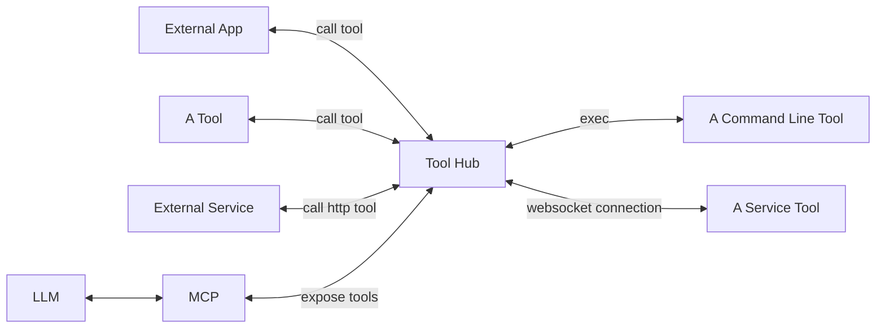
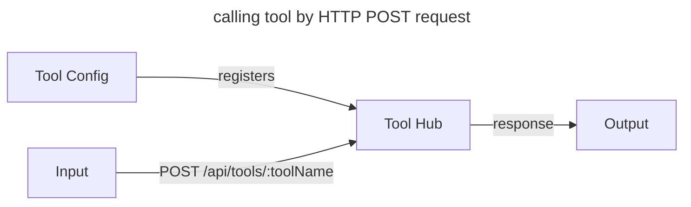

# Tool Hub

## Ecosystem



## Tool Calling

`output = callTool(input, toolConfig)`

Tool types:

* Command‑line tool

  The tool config specifies a working directory, base environment variables, and argument template(s). When the hub receives a POST request it extracts parameters from the request body and substitutes them into the argument template. Large text inputs are passed to the tool via stdin; the tool’s stdout is captured and returned as the output.

* HTTP tool

  The tool config contains the base HTTP request (method, URL, headers, query params, body, timeouts, etc.). For each call, the hub overlays/overrides that base config with values from the POST request body (queries, headers, body) and sends the composed HTTP request. The HTTP response body is returned as the output.

* Service tool

  A long‑running, in‑memory service that registers with the hub over a WebSocket connection. The hub sends input messages to the service via the WebSocket and receives outputs back over the same socket.



## Concurrency Control

Some tool calls can consume significant system resources, such as invoking Ollama Deepseek-r1:14b on a 32GB system. The hub manages tool call concurrency using the `ConcurrencyGroup` configuration in each tool.

Each Concurrency Group represents a FIFO (First-In-First-Out) queue with a `maxConcurrent` limit, controlling the number of simultaneous executions.

* For resource-intensive calls, use the Concurrency Group named `system`.
* To restrict all calls to a specific tool, assign them to a `single tool` concurrency group.
* You can also define custom Concurrency Groups and assign calls from multiple tools to the same group for shared concurrency control.

## Development

This template comes with Vite, React, TypeScript, TailwindCSS and shadcn/ui.

Built with `Wails v2.5.1` and [shadcn's CLI](https://ui.shadcn.com/docs/cli)

### Using the Template

```console
wails init -n project-name -t https://github.com/Mahcks/wails-vite-react-tailwind-shadcnui-ts
```

```console
cd frontend
```

```console
npm install
```

### Installing Components

To install components, use shadcn's CLI tool to install

More info here: https://ui.shadcn.com/docs/cli#add

Example:

```console
npx shadcn-ui@latest add [component]
```

## Live Development

To run in live development mode, run `wails dev` in the project directory. In another terminal, go into the `frontend`
directory and run `npm run dev`. The frontend dev server will run on http://localhost:34115. Connect to this in your
browser and connect to your application.

## Building

To build a redistributable, production mode package, use `wails build`.

## pnpm workspace

This repository is set up as a pnpm workspace. It includes `frontend` and `packages/*`.

Quick commands:

```bash
pnpm install
pnpm -w -F frontend dev    # run frontend dev server
pnpm -w -r run build        # run build in all workspace packages
```
